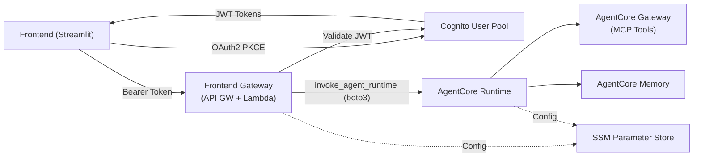

# AWS AgentCore Enterprise Toolkit 🚀

Production-ready, enterprise-grade infrastructure toolkit for Amazon Bedrock AgentCore. Keep the shared infrastructure stable and reuse it across many agents; focus your time on prompts, tools, and UX.

## Purpose

This enterprise toolkit provides teams with a production-ready, agent-agnostic foundation for Amazon Bedrock AgentCore so you can:

- Reuse one shared, AWS-native infrastructure across unlimited agents
- Start new proofs of concept in minutes with a clean, two-phase workflow (Terraform infra → agent code)
- Ship faster with sensible defaults for identity, gateway tools, memory, runtime, and a minimal frontend

Principles: AWS-native first (Cognito, API Gateway, DynamoDB, SSM), Terraform for all infrastructure, Python 3.13 runtime, least-privilege IAM, and clear SSM parameter conventions.

## What you get

- Terraform-based shared infrastructure: Cognito, API Gateway, AgentCore Gateway, Memory, Runtime (KB optional)
- Sample agents: `agents/customer-support/` and `agents/warranty-docs/`
- Global MCP tools (Lambda): warranty check, service locator, web search
- Streamlit frontend with Cognito sign-in
- UV workspace with shared packages (`agentcore-common`, `agentcore-tools`)

## Get started

Follow the stage READMEs for a 10–15 minute quick start per stage:

- Infrastructure (Terraform): `infrastructure/terraform/README.md`
- Global MCP tools: `agents/global-tools/README.md`
- Agent runtimes (customer_support & warranty_docs): `agents/README.md`
- Frontend (Streamlit): `services/frontend_streamlit/README.md`

Tip: The docs index lists all diagrams and stage guides: `docs/README.md`.

## Architecture

The core flow: users authenticate via Cognito, the Streamlit frontend calls the Frontend Gateway (API Gateway + Lambda) with JWT tokens, and the Gateway validates authorization and proxies requests to AgentCore Runtime.

More diagrams (system overview, per-stage components, auth and tool flows) live under `docs/diagrams/` and are linked from each stage README.

## Add another agent

This template is agent-agnostic. To add a new agent, copy the sample, update config, and deploy — no infrastructure changes required. See the Agent Runtime README for the exact steps.

## Contributing and releases

- Contributing guidelines, standards, and deeper implementation details live in `CONTRIBUTING.md`.
- Release process and checklists live in `RELEASE.md`.

## License

[Your License Here]
