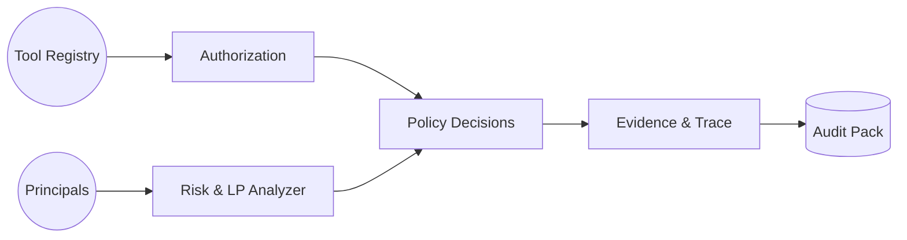

# AgentCore Governance

Enterprise-grade security, authorization, and audit controls for Bedrock AgentCore deployments.

## What Is It?
`agentcore-governance` is a focused Python package that centralizes governance concerns for AI agent runtimes: principal cataloging, least‑privilege scoring, tool authorization, integration approvals, emergency revocation, and tamper‑resistant audit evidence. It provides deterministic, testable building blocks rather than opaque automation.

## Why It Exists
Operating production AI agents requires continuous assurance that access, tools, and external integrations remain within defined risk boundaries. This package supplies:
- Unified principal inventory with inactivity & orphan detection
- Risk and least‑privilege scoring to surface review priorities
- Explicit tool authorization mapped to sensitivity classification
- Time‑bounded third‑party integration approvals
- Rapid revocation workflow with propagation tracking
- End‑to‑end correlation trace reconstruction for audits

## How It Works
Internally, governance composes small modules (catalog, analyzer, authorization, integrations, revocation, evidence). Each decision or event can be correlated and hashed for integrity. The analyzer enriches principals; authorization gates tool usage; evidence reconstructs sequences for compliance.

### High-Level Flow


### Module Layout
```
src/agentcore_governance/
  api/                # Thin REST handlers
  analyzer.py         # Risk & least-privilege scoring
  authorization.py    # Agent → tool authorization mapping
  catalog.py          # Principal aggregation & inactivity
  classification.py   # Tool sensitivity registry
  integrations.py     # Third-party approvals (expiry aware)
  revocation.py       # Emergency revocation tracking
  evidence.py         # Event construction & integrity hashes
  correlation.py      # Correlation ID propagation helpers
  integrity.py        # Deterministic hashing utilities
  abac_matrix.py      # Attribute-based access export helpers
```

## Quick Start
Install dependencies (project uses `uv`).
```bash
uv sync
```
Fetch and score principals:
```python
from agentcore_governance.catalog import fetch_principal_catalog, flag_inactive_principals
from agentcore_governance.analyzer import enrich_principals_with_scores

principals = fetch_principal_catalog(environments=["dev"])
principals = flag_inactive_principals(principals, inactivity_threshold=30)
principals = enrich_principals_with_scores(principals)
```
Authorize tools for an agent:
```python
from agentcore_governance.authorization import set_authorized_tools

change_report = set_authorized_tools(
    agent_id="customer-support-agent-v1",
    tools=["get_product_info", "search_documentation", "check_warranty"],
    reason="Initial provisioning"
)
```
Reconstruct an audit trace:
```python
from agentcore_governance.evidence import reconstruct_correlation_chain
chain = reconstruct_correlation_chain("req-abc123-def456")
```

## Key Capabilities
- Catalog: Unified principal snapshot + inactivity/orphan detection
- Analyzer: Least‑privilege scoring & risk aggregation
- Authorization: Deterministic tool access lifecycle & cleanup
- Integrations: Approval + expiry enforcement for external services
- Revocation: Fast incident response with SLA metrics
- Evidence: Correlated, hash‑verified event reconstruction
- ABAC Matrix: Export attribute feasibility for future policy modeling

## Testing (Essentials)
```bash
uv run pytest tests/unit/governance -v
uv run pytest tests/integration/governance -v
```

## Observability (Summary)
Emits metrics (counts, latency, conformance), structured logs (correlation + integrity hash), and supports trace stitching via correlation IDs.

## Next Steps
- See `Userguide.md` for full workflows, advanced features, endpoint details, troubleshooting, and operational guidance.
- Review `security/tool-classification.yaml` to tune sensitivity levels.
- Integrate metrics into dashboards for revocation SLA & risk trend tracking.
- Use `scripts/local/governance-end-to-end.sh` (or `uv run python scripts/local/governance_end_to_end.py`) to execute the full governance orchestration against an AWS account. See `specs/001-security-role-audit/runbook.md` for prerequisites and artifact review steps.

## Contributing
Follow repository contribution guidelines in `CONTRIBUTING.md`. Add tests for new modules and keep documentation current.

## License
Refer to root `LICENSE` file.
