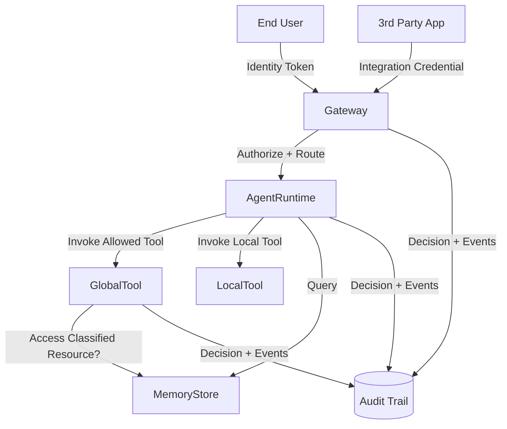

# Feature Specification: Enterprise Security Role & Token Audit and Control Model

**Feature Branch**: `001-security-role-audit`
**Created**: 2025-11-05
**Status**: Draft
**Input**: User description: "security validation, I'd like you step by step analyse every role and tokens created in infrastructure/ and how it used by agents/ and frontend/ we need to document it, using visuals mermaid graphs and compare it with the best enterprice practices. Overall there is the infra for the enterprice and their admin needs to be able keep control over all users, permissions, access to specific agents, agents to specific tools, global tool exposure to 3-d party applications. Security first!"

## Overview

Establish an auditable, least‑privilege, enterprise governance model over all execution principals ("roles"), trust relationships, scoped capabilities, user tokens, and tool/agent access pathways in the AI agent platform. Deliver a specification that documents current state, identifies gaps vs. enterprise security best practices (principle of least privilege, separation of duties, centralized identity & policy lifecycle, traceability, rapid revocation, zero standing privilege where feasible), and defines standardized controls and measurable success criteria. Includes visual relationship graphs, standardized entity definitions, functional requirements for governance, and a controlled model for third‑party tool exposure.

## Problem Statement

Current infrastructure defines multiple execution principals (runtime execution, gateway, memory provisioner, gateway provisioner, targets provisioner, knowledge base, tool lambdas) and user token flows (end-user authentication tokens, internal service assumptions, parameter resolution) without a unified, business-facing control and assurance model. Enterprise administrators require authoritative visibility, lifecycle governance, and rapid response capabilities to: (1) bound agent-to-tool access, (2) gate third‑party exposure, (3) enforce policy hygiene, (4) ensure traceable user-to-action linkage, and (5) prevent drift leading to over‑privilege or orphaned identities.

## Goals

1. Provide a canonical inventory and classification of all principals and token types.
2. Define governance workflows for granting/revoking: user → agent, agent → tool, gateway → tool lambda, agent → memory/knowledge resources, third‑party application → gateway target.
3. Enable continuous compliance checks (least privilege, no unused role > X days, no wildcard beyond approved patterns, all cross‑service trust justified).
4. Ensure auditable mapping from end-user identity to downstream tool invocation events.
5. Introduce standardized authorization decision points where future central policy engines (e.g., attribute / context based) can integrate.
6. Provide success criteria measurable without implementation specifics.

## Non‑Goals

- Redesign of core platform execution architecture.
- Immediate build-out of a full custom admin UI (phased approach adopted).
- Selection of specific third‑party identity providers.
- Replacement of existing token issuance mechanism.

## Actors

- **Enterprise Security Admin**: Owns global policy, approves high‑risk tool exposures.
- **Platform Operator**: Manages agent lifecycle (deploy/update) subject to security guardrails.
- **Tool Owner**: Maintains a specific global or local tool’s contract and access classification.
- **End User**: Authenticated human or application consuming agent capability.
- **Third‑Party Integrator**: External application seeking scoped tool/agent access.
- **Compliance Auditor**: Reviews evidence of control adherence.

## Current Principal & Trust Topology (Documented State)

```mermaid
flowchart LR
  subgraph User Layer
    U[End User Token]
  end
  subgraph Gateway Layer
    GW[Gateway Service Principal]
    GWT[Gateway Targets (Tool Registrations)]
  end
  subgraph Runtime Layer
    RT[Runtime Execution Principal]
    LT[Local Tools]
  end
  subgraph Shared Tools
    T1[Global Tool Lambda A]
    T2[Global Tool Lambda B]
  end
  subgraph Memory & Knowledge
    MEM[Memory Access]
    KB[Knowledge Base Principal]
  end

  U -->|JWT / ID Token| GW
  GW -->|Authorizes & Routes| RT
  RT -->|Invoke| T1
  RT -->|Invoke| T2
  GW -->|Registered Target Binding| T1
  GW -->|Registered Target Binding| T2
  RT -->|Read/Query| MEM
  KB -->|Embed/Search| MEM
```

## Token & Credential Classes

- **User Session Token**: Short‑lived identity token used at gateway boundary; must be traceable through to tool events.
- **Assumed Service Principal Session**: Temporary credentials when service assumes execution principal (rotation ensures minimal standing privilege).
- **Tool Invocation Context**: Inferred call identity (agent + user) propagated to logging/audit.
- **Configuration Resolution Token**: Access to configuration parameters (read-only) for runtime initialization.

## Risks / Gaps Identified (Initial)

- No centralized catalog documenting justification & owner for each principal.
- Potential over‑broad wildcard patterns for model invocation (family wildcard acceptable but must be periodically reviewed).
- Lack of automated orphan role / unused policy detection.
- No formal classification of tools by sensitivity (PII access, external calls, data exfiltration potential).
- Third‑party exposure governance model chosen (static allowlist) but not yet implemented.
- Authorization model currently purely RBAC; ABAC evaluation deferred pending baseline audit.

## User Scenarios & Testing *(mandatory)*

### User Story 1 - Inventory & Ownership Visibility (Priority: P1)

An Enterprise Security Admin views a unified inventory of all principals, their purpose classification (runtime, provisioning, gateway, tool, knowledge, memory), last used timestamp, owning team, and associated least‑privilege evaluation status.

**Why this priority**: Foundational visibility; without it downstream enforcement and revocation are blind.

**Independent Test**: Produce inventory report and verify every deployed principal across environments appears with mandatory metadata fields populated.

**Acceptance Scenarios**:
1. **Given** a freshly provisioned environment, **When** the admin requests the inventory, **Then** all principals appear with purpose, owner, last_used (null if never), and risk_rating.
2. **Given** a principal unused for >30 days, **When** the report is generated, **Then** it is flagged as candidate for review.

---

### User Story 2 - Tool Access Governance (Priority: P1)

Security Admin restricts an agent from invoking a specific global tool; subsequent agent requests to that tool are denied and logged with policy reference.

**Why this priority**: Prevent misuse / lateral movement via high‑risk tools.

**Independent Test**: Remove tool from authorized list → attempt invocation → expect deterministic denial event with auditable record.

**Acceptance Scenarios**:
1. **Given** a tool previously authorized, **When** authorization is revoked, **Then** subsequent invocations fail with access_denied classification.
2. **Given** a tool classified sensitive, **When** an agent not on its allowlist attempts use, **Then** the event is blocked and logged.

---

### User Story 3 - Third‑Party Integration Onboarding (Priority: P2)

Platform Operator onboards a third‑party application to call a subset of gateway targets through an approval workflow capturing business justification.

**Why this priority**: Enables controlled ecosystem growth while enforcing oversight.

**Independent Test**: Submit registration with justification → approval recorded → access token enables only approved targets.

**Acceptance Scenarios**:
1. **Given** an onboarding request, **When** Security Admin denies it, **Then** no access token or mapping is created.
2. **Given** an approved integration, **When** it attempts an unapproved target, **Then** access is denied with reason.

---

### User Story 4 - Rapid Revocation (Priority: P2)

Security Admin triggers emergency revoke for a compromised user; subsequent agent invocations with that token fail within defined propagation window.

**Why this priority**: Incident containment.

**Independent Test**: Use token post‑revocation; verify denial within target SLA.

**Acceptance Scenarios**:
1. **Given** a valid user token, **When** admin revokes it, **Then** new requests after revocation window are rejected.
2. **Given** an in‑flight tool invocation, **When** revocation occurs, **Then** completion is allowed but further chained calls are blocked (graceful containment).

---

### User Story 5 - Audit Trace Reconstruction (Priority: P3)

Compliance Auditor reconstructs a full chain: user identity → agent invocation → tool call → resource access decisions, within the retention window.

**Why this priority**: Regulatory evidence and incident forensics.

**Independent Test**: Select random invocation; produce linked log artifacts with consistent correlation IDs.

**Acceptance Scenarios**:
1. **Given** an invocation ID, **When** auditor queries logs, **Then** all hops (gateway, runtime, tool) are traceable.
2. **Given** missing segment, **When** integrity check runs, **Then** alert is generated.

### Edge Cases

- Expired token replay attempt → must yield explicit authentication_expired classification.
- Tool removed while an agent session active → new calls blocked, existing streaming gracefully terminated.
- Orphan principal (no owner tag) introduced → flagged within next inventory cycle.
- Overlapping revocations (user & tool) → system reports both conditions without masking root cause.
- Third‑party integration attempts escalation by registering undeclared target name → rejected & logged as policy_violation.

## Requirements *(mandatory)*

### Functional Requirements

- **FR-001**: System MUST maintain an authoritative catalog of all principals with owner, purpose, creation time, last used timestamp.
- **FR-002**: System MUST support revoking user token access such that new invocations are blocked within a defined SLA (<= 5 minutes P1 environment, <= 15 minutes others).
- **FR-003**: System MUST allow per‑agent allow/deny lists for global tools and enforce them deterministically at invocation time.
- **FR-004**: System MUST log every tool invocation with correlation identifiers linking user, agent, tool, decision (allow/deny), and policy reference.
- **FR-005**: System MUST flag principals unused for >30 days for review.
- **FR-006**: System MUST enforce classification labels (e.g., LOW, MODERATE, SENSITIVE) on tools before activation.
- **FR-007**: System MUST block activation of a SENSITIVE tool without explicit Security Admin approval event.
- **FR-008**: System MUST generate a least‑privilege conformance report (wildcards, unused actions, cross‑service trust) at least daily.
- **FR-009**: System MUST provide an auditable workflow for third‑party integration onboarding with approval, denial, and expiry.
- **FR-010**: System MUST support emergency revocation of third‑party integration credentials with same SLA as user tokens.
- **FR-011**: System MUST ensure correlation ID continuity across gateway, runtime, tool, and memory access events.
- **FR-012**: System MUST detect and alert on missing or malformed audit events within 5 minutes of occurrence.
- **FR-013**: System MUST provide exportable evidence packs (inventory snapshot + last 24h audit trail) on demand within 2 minutes.
- **FR-014**: System MUST prevent unregistered tools from being invoked (no implicit discovery).
- **FR-015**: System MUST maintain a mapping of each tool to its declared data sensitivity & external connectivity profile.
- **FR-016**: System MUST restrict cross‑environment access (an agent in one environment cannot invoke tools in another).
- **FR-017**: System MUST ensure configuration parameter access is read‑only and restricted to approved paths.
- **FR-018**: System MUST allow scheduled certification attestation for critical principals (quarterly re‑approval record).
- **FR-019**: System SHOULD provide differential report highlighting policy changes since last baseline.
- **FR-020**: System SHOULD support policy simulation for prospective tool authorization changes.
- **FR-021**: System SHOULD support risk scoring aggregation (tools × privileges × usage frequency).
- **FR-022**: System SHOULD detect orphan principals (missing owner tag) within 24h.
- **FR-023**: System SHOULD provide API to query authorization decision history per tool.
- **FR-024**: System MAY integrate future centralized attribute‑based policies without redesign of enforcement points.
- **FR-025**: System MUST store approval and revocation rationale for at least retention window (>= 400 days) unless legal hold extends.

Clarification Outcomes Incorporated:
- **FR-026**: System MUST adopt phased governance surface: initial reliance on existing cloud IAM/logging consoles plus export/report API; custom delegated admin UI MAY be planned after baseline stabilization.
- **FR-027**: System MUST implement a static allowlist third‑party onboarding process (manual registration + periodic review) with justification capture and expiry metadata.
- **FR-028**: System MUST document current RBAC bindings (user→agent→tool) and produce an ABAC feasibility assessment report (attributes, candidate sources) without implementing ABAC in initial release.

### Key Entities

- **Principal**: Execution identity with attributes (id, type, owner, purpose, last_used, risk_rating, approvals[]).
- **Tool**: Callable capability (id, classification, sensitivity_level, allowed_agents[], external_connectivity, status).
- **Agent**: Orchestrator (id, description, authorized_tools[], memory_profile, status).
- **Integration**: Third‑party registration (id, requester, approved_targets[], approval_record, expiry, status).
- **Policy Decision**: Record (timestamp, subject, action, resource, effect, policy_reference, correlation_id).
- **Audit Event**: Structured log (event_type, correlation_id, principal_chain[], outcome, latency, integrity_hash).
- **Revocation**: Control (subject_type, subject_id, initiated_by, timestamp, scope, propagated_at, status).
- **Classification**: Glossary entry (label, criteria, requires_approval, review_interval_days).

## Success Criteria *(mandatory)*

### Measurable Outcomes

- **SC-001**: 100% of principals present in catalog with required metadata fields.
- **SC-002**: ≥ 99% of revocations propagate within SLA thresholds (P1 ≤ 5m / others ≤ 15m).
- **SC-003**: ≤ 2% of tool invocation audit events missing correlation linkage in any rolling 24h window.
- **SC-004**: 0 unauthorized tool invocations (blocked attempts logged, none succeed) per monthly reporting cycle.
- **SC-005**: 100% SENSITIVE-classified tools show explicit approval record prior to first successful invocation.
- **SC-006**: Orphan principals reduced to 0 within 14 days of feature launch; sustained ≤ 1 thereafter.
- **SC-007**: Least‑privilege conformance score (defined as % policies without extraneous actions) ≥ 95% after remediation phase.
- **SC-008**: Evidence pack generation median time ≤ 120 seconds.
- **SC-009**: Audit event integrity (no tamper hash failures) = 100% over rolling 30 days.
- **SC-010**: Third‑party onboarding request cycle time (submission → decision) median ≤ 2 business days.

## Assumptions

- Existing identity provider continues issuing user tokens with stable claim set.
- Tool classification rubric will be provided by security governance within 2 weeks.
- Daily batch or streaming analytics engine available for conformance calculations.
- Time synchronization across components within acceptable drift (< 2s) for correlation.
- Retention storage costs approved for target window.
- Future ABAC integration can reuse current decision audit schema without migration.

## Dependencies

- Central tagging standard for owner/team metadata.
- Logging pipeline capable of structured event enrichment.
- Governance process definition (approval, periodic review) from security org.

## Out of Scope

- Cryptographic redesign of token issuance.
- Data residency / geo‑partitioning strategies.
- UI wireframes or implementation details.

## Acceptance Metrics Validation Approach

- Automated nightly job computes SC-001 to SC-007; alerts on threshold breach.
- Synthetic revocation tests scheduled every 4 hours to measure SC-002.
- Integrity hash verification continuous lambda for SC-009.

## Current State Audit

### IAM Roles & Attached Capabilities

| Role | Purpose | Key Policies / Actions | Scope Controls | Observations |
|------|---------|------------------------|----------------|--------------|
| Execution Role | Agent runtime execution | bedrock_invoke (Claude/Titan families), ssm_read, bedrock_gateway, bedrock_memory, lambda_invoke (namespaced tools), ecr_pull, logs/xray | Model ARNs family wildcard; SSM path constrained to environment; Lambda invoke pattern `${namespace}-*-tool-*` | Broad but environment-scoped; review cross-region model wildcards quarterly. |
| Gateway Role | Bedrock AgentCore Gateway service principal | lambda:InvokeFunction (namespaced tool lambdas) | Pattern-based resource ARNs | Ensure no unused tool functions remain deployed. |
| Gateway Provisioner Role | Custom resource provisioning gateway | bedrock-agentcore:Create/Update/Delete/ListGateway, PassRole (gateway_role), SSM gateway params | SSM path prefix; PassRole condition on service | Powerful; restrict usage to provisioning pipeline. |
| Memory Provisioner Role | Custom resource provisioning memory | bedrock-agentcore memory CRUD, bedrock:InvokeModel (embedding), SSM memory params | SSM path prefix | Embedding model wildcard limited to Titan embed; acceptable. |
| Targets Provisioner Role | Register global tools (gateway targets) | bedrock-agentcore target CRUD, SSM gateway params | SSM path prefix | Needs ownership tagging for traceability. |
| Knowledge Base Role | Optional KB operations | S3 read, aoss:APIAccessAll, bedrock:InvokeModel (embedding) | Resource-specific ARNs | Only provisioned if KB enabled; monitor aoss broad action. |
| Tool Lambda Roles (per tool) | Execute tool logic | Basic execution, tracing, logging | Auto-generated by module | Consider adding least-privilege custom policies if tools access other AWS services. |

### Token & Credential Pathways

- User Cognito ID Token: Presented at gateway boundary; validated; drives authorization to invoke agents.
- Service Role Assumption: Gateway/AgentCore services assume respective IAM roles (STS) for execution; temporary credentials reduce standing privilege.
- Parameter Resolution: Runtime uses execution role SSM read policy for config values under `/agentcore/{env}/*`.
- Tool Invocation Chain: Agent runtime invokes tool Lambda with execution role; tool lambdas inherit their own roles.
- Memory Access: Runtime role directly invokes memory-related agentcore actions; events/audit should correlate user identity.

### Least Privilege Assessment Highlights

- Model family wildcards are unavoidable at current AWS granularity; mitigation: scheduled review + logging of actual model versions used.
- ECR policy limited to repository prefix `bedrock-agentcore-*` — acceptable; monitor repository sprawl.
- Lambda invoke patterns rely on namespace + suffix; need detection of unused/deprecated tool functions.
- Provisioner roles possess create/delete powers; ensure isolated execution path and monitoring (no ad-hoc usage).
- Absence of explicit tool sensitivity classification today increases risk of unnoticed high-impact changes.

### Orphan / Drift Risks

- Roles missing `Owner` or `Purpose` tagging reduce audit clarity.
- Tool lambdas may accumulate without deregistration on retirement.
- Potential stale gateway targets after tool removal.

## Upgrade Roadmap (Post-Audit)

1. Principal Catalog Service (inventory + tagging enforcement + inactivity detection).
2. Tool Classification Framework (LOW/MODERATE/SENSITIVE + approval workflow for SENSITIVE).
3. Static Third-Party Allowlist Workflow (request justification, manual approval, expiry scheduling).
4. Revocation SLA Instrumentation (synthetic tests + dashboards for propagation metrics).
5. Audit Correlation Enrichment (ensure user identity flows into memory/tool events consistently).
6. Least-Privilege Analyzer (daily diff of IAM policies vs. expected baseline, wildcard justification ledger).
7. Orphan Resource Detector (roles/tools/targets without active references or owner tags).
8. RBAC Inventory & ABAC Feasibility Report (attributes like sensitivity, environment, risk; recommendation doc).
9. Evidence Pack Automation (on-demand packaging of catalog + last 24h audit + conformance score).
10. Deprecated Tool Lifecycle (retirement checklist + automatic gateway target cleanup).

## Clarifications Resolved

- Governance Surface: Phased approach (existing consoles + export/report API first; custom UI later if justified).
- Third-Party Onboarding: Static allowlist with manual approval & periodic review.
- Authorization Evolution: Remain RBAC initially; produce ABAC feasibility assessment rather than immediate adoption.

## Risks & Mitigations

- **Risk**: Policy sprawl increases complexity. **Mitigation**: Central catalog & differential reporting (FR-019).
- **Risk**: Overhead of approvals delays innovation. **Mitigation**: Tiered classification; LOW bypass manual approval.
- **Risk**: Audit log volume cost. **Mitigation**: Structured, compressed retention tiers.
- **Risk**: Revocation race conditions. **Mitigation**: SLA monitoring + synthetic probes.
- **Risk**: Tool misclassification. **Mitigation**: Mandatory classification with periodic attestation.

## Appendices

### Additional Relationship Diagram (Extended)



---

All clarification markers resolved; FR-026..028 finalized as above.


## User Scenarios & Testing *(mandatory)*

<!--
  IMPORTANT: User stories should be PRIORITIZED as user journeys ordered by importance.
  Each user story/journey must be INDEPENDENTLY TESTABLE - meaning if you implement just ONE of them,
  you should still have a viable MVP (Minimum Viable Product) that delivers value.

  Assign priorities (P1, P2, P3, etc.) to each story, where P1 is the most critical.
  Think of each story as a standalone slice of functionality that can be:
  - Developed independently
  - Tested independently
  - Deployed independently
  - Demonstrated to users independently
-->

### User Story 1 - [Brief Title] (Priority: P1)

[Describe this user journey in plain language]

**Why this priority**: [Explain the value and why it has this priority level]

**Independent Test**: [Describe how this can be tested independently - e.g., "Can be fully tested by [specific action] and delivers [specific value]"]

**Acceptance Scenarios**:

1. **Given** [initial state], **When** [action], **Then** [expected outcome]
2. **Given** [initial state], **When** [action], **Then** [expected outcome]

---

### User Story 2 - [Brief Title] (Priority: P2)

[Describe this user journey in plain language]

**Why this priority**: [Explain the value and why it has this priority level]

**Independent Test**: [Describe how this can be tested independently]

**Acceptance Scenarios**:

1. **Given** [initial state], **When** [action], **Then** [expected outcome]

---

### User Story 3 - [Brief Title] (Priority: P3)

[Describe this user journey in plain language]

**Why this priority**: [Explain the value and why it has this priority level]

**Independent Test**: [Describe how this can be tested independently]

**Acceptance Scenarios**:

1. **Given** [initial state], **When** [action], **Then** [expected outcome]

---

[Add more user stories as needed, each with an assigned priority]

### Edge Cases

<!--
  ACTION REQUIRED: The content in this section represents placeholders.
  Fill them out with the right edge cases.
-->

- What happens when [boundary condition]?
- How does system handle [error scenario]?

## Requirements *(mandatory)*

<!--
  ACTION REQUIRED: The content in this section represents placeholders.
  Fill them out with the right functional requirements.
-->

### Functional Requirements

- **FR-001**: System MUST [specific capability, e.g., "allow users to create accounts"]
- **FR-002**: System MUST [specific capability, e.g., "validate email addresses"]
- **FR-003**: Users MUST be able to [key interaction, e.g., "reset their password"]
- **FR-004**: System MUST [data requirement, e.g., "persist user preferences"]
- **FR-005**: System MUST [behavior, e.g., "log all security events"]

*Example of marking unclear requirements:*

- **FR-006**: System MUST authenticate users via [NEEDS CLARIFICATION: auth method not specified - email/password, SSO, OAuth?]
- **FR-007**: System MUST retain user data for [NEEDS CLARIFICATION: retention period not specified]

### Key Entities *(include if feature involves data)*

- **[Entity 1]**: [What it represents, key attributes without implementation]
- **[Entity 2]**: [What it represents, relationships to other entities]

## Success Criteria *(mandatory)*

<!--
  ACTION REQUIRED: Define measurable success criteria.
  These must be technology-agnostic and measurable.
-->

### Measurable Outcomes

- **SC-001**: [Measurable metric, e.g., "Users can complete account creation in under 2 minutes"]
- **SC-002**: [Measurable metric, e.g., "System handles 1000 concurrent users without degradation"]
- **SC-003**: [User satisfaction metric, e.g., "90% of users successfully complete primary task on first attempt"]
- **SC-004**: [Business metric, e.g., "Reduce support tickets related to [X] by 50%"]
