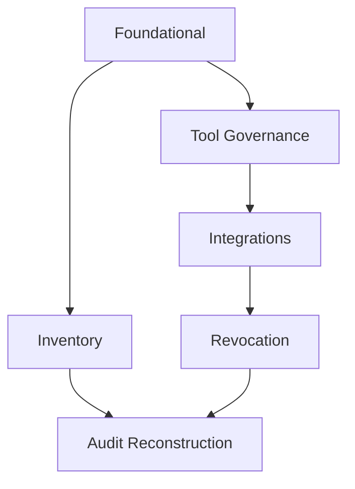

# Tasks: Enterprise Security Role & Token Audit and Control Model

**Branch**: `001-security-role-audit`
**Source Docs**: `spec.md`, `plan.md`, `data-model.md`, `contracts/openapi.yaml`, `research.md`, `quickstart.md`

---
## Phase 1: Setup

Purpose: Establish governance package scaffold, baseline configuration files, and initial analyzer/test harness foundations.

- [X] T001 Create governance package directory structure `packages/agentcore-governance/src/agentcore_governance`
- [X] T002 Add Python package init file `packages/agentcore-governance/src/agentcore_governance/__init__.py`
- [X] T003 Add placeholder catalog module file `packages/agentcore-governance/src/agentcore_governance/catalog.py`
- [X] T004 Add placeholder classification module file `packages/agentcore-governance/src/agentcore_governance/classification.py`
- [X] T005 Add placeholder authorization module file `packages/agentcore-governance/src/agentcore_governance/authorization.py`
- [X] T006 Add placeholder integrations module file `packages/agentcore-governance/src/agentcore_governance/integrations.py`
- [X] T007 Add placeholder revocation module file `packages/agentcore-governance/src/agentcore_governance/revocation.py`
- [X] T008 Add placeholder evidence pack module file `packages/agentcore-governance/src/agentcore_governance/evidence.py`
- [X] T009 Add placeholder least-privilege analyzer script `packages/agentcore-governance/src/agentcore_governance/analyzer.py`
- [X] T010 Create tool classification registry file `security/tool-classification.yaml`
- [X] T011 Create tests directory for unit tests `tests/unit/governance/__init__.py`
- [X] T012 Create integration tests directory `tests/integration/governance/__init__.py`
- [X] T013 [P] Add pyproject for governance package `packages/agentcore-governance/pyproject.toml`
- [X] T014 Add README for governance package `packages/agentcore-governance/README.md`
- [X] T015 Add correlation ID helper module `packages/agentcore-governance/src/agentcore_governance/correlation.py`
- [X] T016 Add integrity hash utility module `packages/agentcore-governance/src/agentcore_governance/integrity.py`
- [X] T017 Add ABAC feasibility matrix export script `packages/agentcore-governance/src/agentcore_governance/abac_matrix.py`
- [X] T018 [P] Add initial test scaffold for catalog module `tests/unit/governance/test_catalog_placeholder.py`
- [X] T019 [P] Add initial test scaffold for analyzer module `tests/unit/governance/test_analyzer_placeholder.py`
- [X] T020 Add OpenAPI contract copy for reference `packages/agentcore-governance/contracts/openapi.yaml`

---
## Phase 2: Foundational

Purpose: Implement core shared services required by all user stories (catalog aggregation, classification loading, correlation, integrity, analyzer baseline).

- [ ] T021 Implement principal catalog aggregation (IAM, SSM, tagging) `packages/agentcore-governance/src/agentcore_governance/catalog.py`
- [ ] T022 Implement policy footprint summarizer (actions, wildcards, scope rating) `packages/agentcore-governance/src/agentcore_governance/catalog.py`
- [ ] T023 Implement least privilege score computation logic `packages/agentcore-governance/src/agentcore_governance/analyzer.py`
- [ ] T024 Implement orphan principal detector `packages/agentcore-governance/src/agentcore_governance/analyzer.py`
- [ ] T025 Implement classification registry loader (YAML parse, validation) `packages/agentcore-governance/src/agentcore_governance/classification.py`
- [ ] T026 Implement correlation ID generator and propagation helpers `packages/agentcore-governance/src/agentcore_governance/correlation.py`
- [ ] T027 Implement integrity hash utility (deterministic concatenation + SHA256) `packages/agentcore-governance/src/agentcore_governance/integrity.py`
- [ ] T028 Implement audit event construction helper `packages/agentcore-governance/src/agentcore_governance/evidence.py`
- [ ] T029 Implement ABAC feasibility matrix exporter (Markdown + CSV) `packages/agentcore-governance/src/agentcore_governance/abac_matrix.py`
- [ ] T030 Implement evidence pack generator (catalog + last 24h logs + conformance score) `packages/agentcore-governance/src/agentcore_governance/evidence.py`
- [ ] T031 [P] Unit tests for catalog aggregation coverage `tests/unit/governance/test_catalog_aggregation.py`
- [ ] T032 [P] Unit tests for analyzer scoring logic `tests/unit/governance/test_analyzer_scoring.py`
- [ ] T033 [P] Unit tests for classification loader `tests/unit/governance/test_classification_loader.py`
- [ ] T034 [P] Unit tests for correlation ID helper `tests/unit/governance/test_correlation.py`
- [ ] T035 [P] Unit tests for integrity hash utility `tests/unit/governance/test_integrity.py`
- [ ] T036 Integration test: evidence pack generation baseline `tests/integration/governance/test_evidence_pack.py`
- [ ] T037 Integration test: ABAC matrix exporter output validation `tests/integration/governance/test_abac_matrix.py`

---
## Phase 3: User Story 1 (Inventory & Ownership Visibility) [Priority P1]

Goal: Deliver inventory catalog endpoint and inactivity flagging.
Independent Test: Invoke `GET /catalog/principals` and confirm completeness + inactivity flag.

- [ ] T038 [US1] Implement `GET /catalog/principals` handler `packages/agentcore-governance/src/agentcore_governance/api/catalog_handlers.py`
- [ ] T039 [P] [US1] Implement inactivity flagging logic (last_used > 30d) `packages/agentcore-governance/src/agentcore_governance/catalog.py`
- [ ] T040 [US1] Add risk rating computation (wildcards + unused actions) `packages/agentcore-governance/src/agentcore_governance/analyzer.py`
- [ ] T041 [US1] Add pagination support for principals list `packages/agentcore-governance/src/agentcore_governance/api/catalog_handlers.py`
- [ ] T042 [US1] Contract test for `/catalog/principals` response schema `tests/integration/governance/test_catalog_endpoint.py`
- [ ] T043 [US1] Add ownership tag validation & fallback labeling `packages/agentcore-governance/src/agentcore_governance/catalog.py`
- [ ] T044 [US1] Add export snapshot (JSON) function `packages/agentcore-governance/src/agentcore_governance/catalog.py`
- [ ] T045 [US1] Integration test for inactivity & risk flags `tests/integration/governance/test_catalog_flags.py`

---
## Phase 4: User Story 2 (Tool Access Governance) [Priority P1]

Goal: Per-agent allow/deny tool mapping and enforcement with classification checks.
Independent Test: Remove a tool via PUT endpoint → subsequent simulated invocation denied.

- [ ] T046 [US2] Implement `GET /authorization/agents/{agentId}/tools` handler `packages/agentcore-governance/src/agentcore_governance/api/authorization_handlers.py`
- [ ] T047 [US2] Implement `PUT /authorization/agents/{agentId}/tools` handler `packages/agentcore-governance/src/agentcore_governance/api/authorization_handlers.py`
- [ ] T048 [P] [US2] Implement in-memory mapping store (on-demand refresh) `packages/agentcore-governance/src/agentcore_governance/authorization.py`
- [ ] T049 [US2] Implement classification enforcement (SENSITIVE requires approval record) `packages/agentcore-governance/src/agentcore_governance/classification.py`
- [ ] T050 [US2] Add audit event for allow/deny decision `packages/agentcore-governance/src/agentcore_governance/evidence.py`
- [ ] T051 [US2] Contract tests for GET/PUT tool authorization endpoints `tests/integration/governance/test_authorization_endpoints.py`
- [ ] T052 [US2] Simulated invocation test verifying denied unauthorized tool `tests/integration/governance/test_tool_deny_flow.py`
- [ ] T053 [US2] Add differential report for authorization mapping changes `packages/agentcore-governance/src/agentcore_governance/authorization.py`

---
## Phase 5: User Story 3 (Third-Party Integration Onboarding) [Priority P2]

Goal: Static allowlist workflow with request, approval, expiry.
Independent Test: Submit request → approve → restricted targets accessible; unapproved target denied.

- [ ] T054 [US3] Implement `POST /integrations` request handler `packages/agentcore-governance/src/agentcore_governance/api/integration_handlers.py`
- [ ] T055 [US3] Implement `POST /integrations/{integrationId}/approve` handler `packages/agentcore-governance/src/agentcore_governance/api/integration_handlers.py`
- [ ] T056 [P] [US3] Implement integration registry (YAML or JSON) `packages/agentcore-governance/src/agentcore_governance/integrations.py`
- [ ] T057 [US3] Implement expiry scheduling logic (mark status expired) `packages/agentcore-governance/src/agentcore_governance/integrations.py`
- [ ] T058 [US3] Add audit events for request and approval `packages/agentcore-governance/src/agentcore_governance/evidence.py`
- [ ] T059 [US3] Contract tests for integration endpoints `tests/integration/governance/test_integrations_endpoints.py`
- [ ] T060 [US3] Denial path test (unapproved target access) `tests/integration/governance/test_integration_denial.py`
- [ ] T061 [US3] Expiry scenario test `tests/integration/governance/test_integration_expiry.py`

---
## Phase 6: User Story 4 (Rapid Revocation) [Priority P2]

Goal: Emergency revocation flow with SLA tracking.
Independent Test: Issue revocation → token simulation blocked within SLA.

- [ ] T062 [US4] Implement `POST /revocations` handler `packages/agentcore-governance/src/agentcore_governance/api/revocation_handlers.py`
- [ ] T063 [US4] Implement `GET /revocations/{revocationId}` handler `packages/agentcore-governance/src/agentcore_governance/api/revocation_handlers.py`
- [ ] T064 [US4] Implement propagation tracker (pending → complete) `packages/agentcore-governance/src/agentcore_governance/revocation.py`
- [ ] T065 [P] [US4] Implement synthetic revocation test scheduler script `packages/agentcore-governance/src/agentcore_governance/revocation_synthetic.py`
- [ ] T066 [US4] Implement SLA metric emission (latency to complete) `packages/agentcore-governance/src/agentcore_governance/revocation.py`
- [ ] T067 [US4] Contract tests for revocation endpoints `tests/integration/governance/test_revocation_endpoints.py`
- [ ] T068 [US4] Synthetic test validation (forced expired token scenario) `tests/integration/governance/test_revocation_sla.py`
- [ ] T069 [US4] Audit event integrity test for revocation events `tests/integration/governance/test_revocation_audit.py`

---
## Phase 7: User Story 5 (Audit Trace Reconstruction) [Priority P3]

Goal: End-to-end trace, decision history, evidence pack reliability.
Independent Test: Provide invocation ID → reconstruct chain from logs + decisions without gaps.

- [ ] T070 [US5] Implement `/decisions` listing handler `packages/agentcore-governance/src/agentcore_governance/api/decision_handlers.py`
- [ ] T071 [US5] Implement `/analyzer/least-privilege` handler `packages/agentcore-governance/src/agentcore_governance/api/analyzer_handlers.py`
- [ ] T072 [US5] Implement `/evidence-pack` handler `packages/agentcore-governance/src/agentcore_governance/api/evidence_handlers.py`
- [ ] T073 [P] [US5] Implement missing event detector alert logic `packages/agentcore-governance/src/agentcore_governance/evidence.py`
- [ ] T074 [US5] Implement correlation chain reconstruction function `packages/agentcore-governance/src/agentcore_governance/evidence.py`
- [ ] T075 [US5] Contract tests for decisions/analyzer/evidence-pack endpoints `tests/integration/governance/test_decisions_analyzer_evidence.py`
- [ ] T076 [US5] Integrity hash tamper detection test `tests/integration/governance/test_integrity_detection.py`
- [ ] T077 [US5] Evidence pack performance test (timing assertion) `tests/integration/governance/test_evidence_pack_perf.py`

---
## Phase 8: Polish & Cross-Cutting

Purpose: Optimization, documentation, differential reports, ABAC feasibility artifact finalization.

- [ ] T078 Add differential policy change report (FR-019) `packages/agentcore-governance/src/agentcore_governance/analyzer.py`
- [ ] T079 Add authorization decision history endpoint `/decisions?subjectId=` enhancements `packages/agentcore-governance/src/agentcore_governance/api/decision_handlers.py`
- [ ] T080 Add risk scoring aggregation (FR-021) `packages/agentcore-governance/src/agentcore_governance/analyzer.py`
- [ ] T081 Add quarterly attestation scheduling stub (FR-018) `packages/agentcore-governance/src/agentcore_governance/catalog.py`
- [ ] T082 Add deprecated tool lifecycle cleanup logic `packages/agentcore-governance/src/agentcore_governance/authorization.py`
- [ ] T083 Add ABAC feasibility CSV export integration `packages/agentcore-governance/src/agentcore_governance/abac_matrix.py`
- [ ] T084 Write extended README with governance workflow `packages/agentcore-governance/README.md`
- [ ] T085 Add quickstart cross-check script `packages/agentcore-governance/src/agentcore_governance/quickstart_check.py`
- [ ] T086 Add metrics emission wrappers for key endpoints `packages/agentcore-governance/src/agentcore_governance/api/metrics.py`
- [ ] T087 Add orphan resource remediation script `packages/agentcore-governance/src/agentcore_governance/orphan_cleanup.py`
- [ ] T088 Final integration test full scenario (end-to-end trace) `tests/integration/governance/test_full_trace_reconstruction.py`
- [ ] T089 Final conformance score threshold alert test `tests/integration/governance/test_conformance_threshold.py`
- [ ] T090 Documentation sync validation script `packages/agentcore-governance/src/agentcore_governance/doc_sync.py`

---
## Dependency Graph (Story Order)

Inventory (US1) → Tool Governance (US2) → Integrations (US3) → Revocation (US4) → Audit Reconstruction (US5)

Foundational (Phase 2) must complete before any story phases. P1 stories (US1, US2) can run in parallel after foundational tasks T021–T036 complete.

### Mermaid Representation

## Parallel Execution Examples
- After T021–T030, tasks T031–T035 run in parallel.
- In US1: T039 risk/inactivity can run parallel to T038 endpoint handler.
- In US2: T048 mapping store can run parallel with T046 endpoint definition.
- In US4: T065 synthetic test scheduler parallel with T062 handler implementation.
- In US5: T073 missing event detector parallel with T070 decisions handler.

## Independent Test Criteria per Story
- US1: Single call to `/catalog/principals` returns full inventory with inactivity & risk flags.
- US2: Modify authorization via PUT; subsequent simulated tool invocation denied (audit log contains decision).
- US3: Submit and approve integration; only approved targets accessible; denial for others.
- US4: Revocation request causes token-based access denial within SLA window.
- US5: Provide correlation ID; system reconstructs chain with zero missing events; evidence pack generated under time target.

## Suggested MVP Scope
MVP = Phase 2 + Phase 3 (US1). Delivers visibility foundation and scoring necessary for governance insights.

## Format Validation
All tasks include: checkbox, sequential TaskID, optional [P] marker for parallelizable tasks, [USx] label for story phases, and explicit file paths.

---
## Implementation Strategy
1. MVP: Complete Foundational + Inventory (visibility & scoring).
2. Governance Controls: Add Tool Access (US2) for enforcement.
3. Expansion: Integrations & Revocation flows (US3, US4).
4. Advanced Audit: Reconstruction & evidence pack optimization (US5).
5. Polish: Risk aggregation, differential reports, attestation automation.

Post-MVP success measured by SC-001, SC-006, SC-007 achievement and readiness for enforcement phases.
